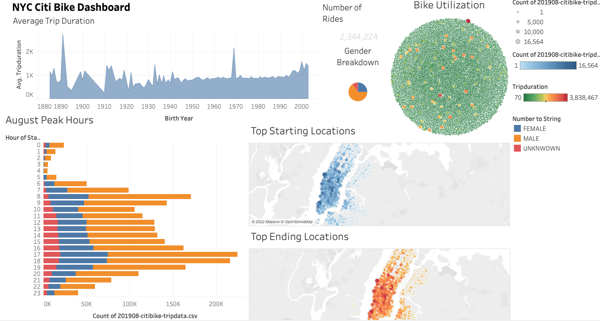
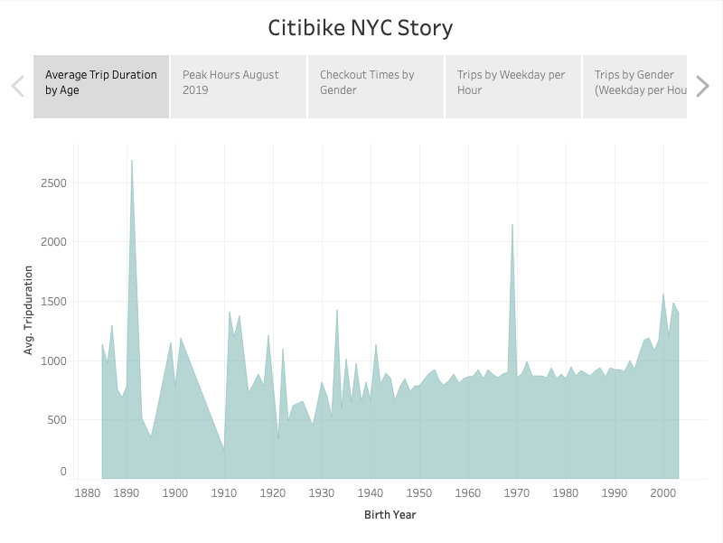
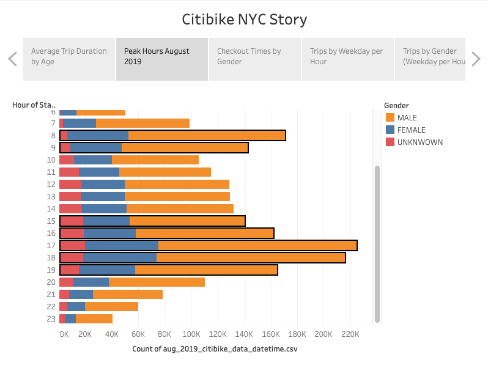
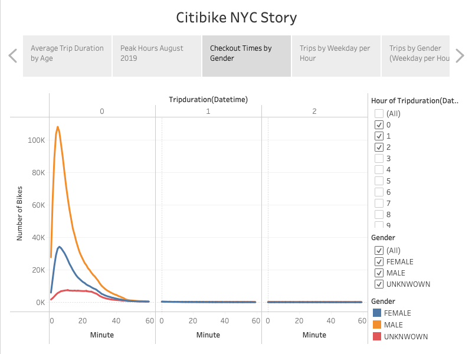
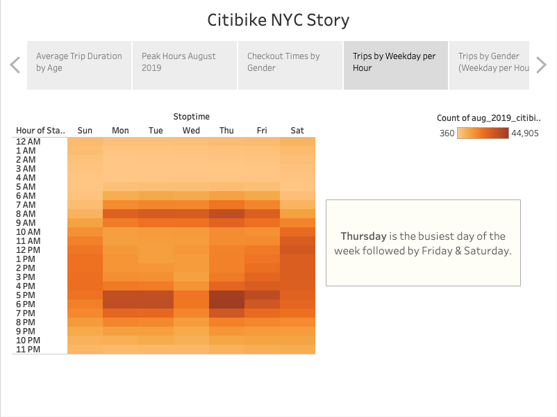
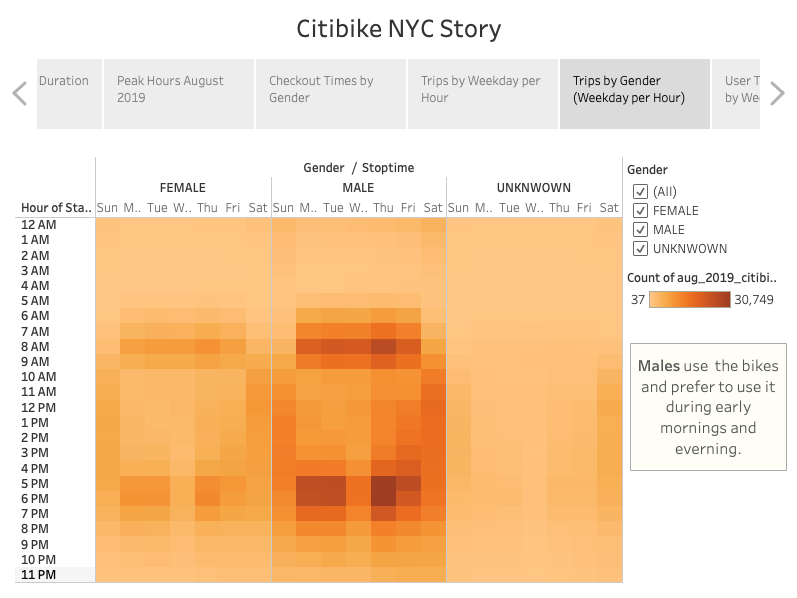
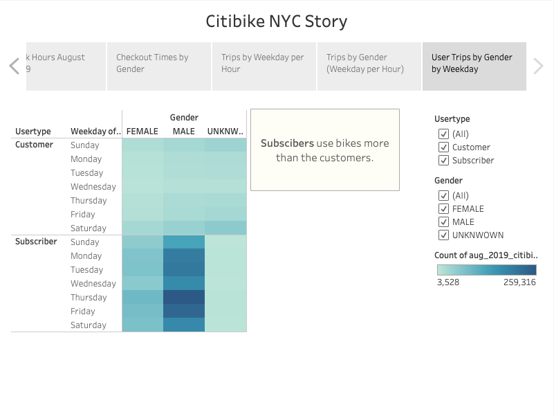
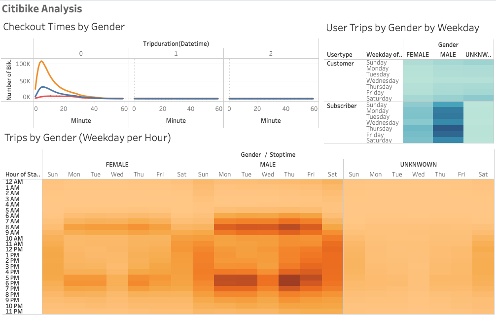
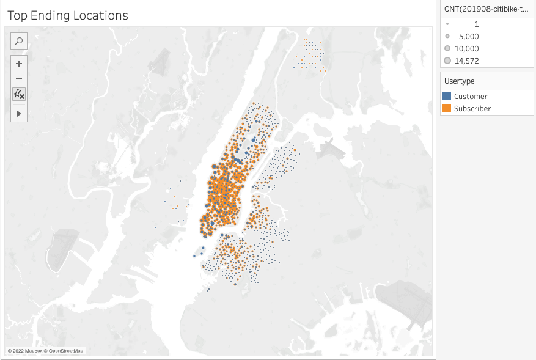
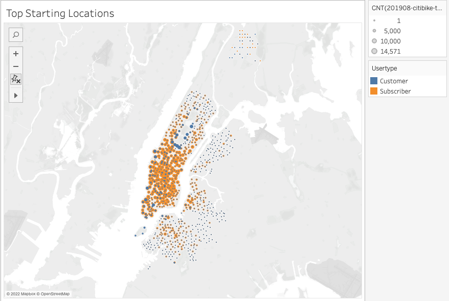

# bikesharing

## Overview of the analysis
After utilising the Citi Bike to explore different New York City. We aim to launch a comparable bike-sharing company in Des Moines. In light of the fact that the goal of this analysis is to identify the elements that make using a Citi Bike in New York City a wonderful experience, including the best times, top stations, demographics, user types, etc., it is a great choice to analyse the Citi Bike data using Tableau in order to develop a proposal for bike share in Des Moines that will be presented to the investors.

## Resources 
### Data Sources: 
We used the following NYC citibike Data [201908-citibike-tripdata.csv.zip](https://s3.amazonaws.com/tripdata/index.html) to analyze the trends and use the findings to start a similar Bike share business in Des Moines.

### Softwares:

## Results

Below is the final snapshot of the [Dashboard](https://public.tableau.com/app/profile/avinash.mehra/viz/CitiBike_Challenge_16601345010310/CitibikeNYCStory?publish=yes):

and snapshot of [Module_Dashboard](https://public.tableau.com/app/profile/avinash.mehra/viz/CitiBike_Module_16601351817050/NYCCitiBike?publish=yes)

### Average trip duration by age:
In Tableau, area charts are essentially filled-in versions of line charts. To create one, drag the Tripduration measurement into the Rows area and the Birth Year dimension into the Columns part.

### Peak Hours August
We can compare the hours using bar charts because the "Starttime" dimension is a strong predictor of the time of day that consumers often start their bike rides in the "Rows" column. We will arrange the tripdata count field that was generated into columns.

### Checkout Times by Gender
The number of bikes checked out by duration for each gender each hour is shown on a line graph that may be filtered by the hour and gender. 
This will allow us to determine if it was men, women, or someone else who made the most trips each hour.

### Trips by Weekday for each Hour
The number of bike trips for each hour of each day of the week are displayed on a heatmap. 
This will enable us to determine the busiest days of the week as well as the hours of the week when the most bicycles are being used.

### Trips by Gender (Weekday per Hour)
The number of bike trips by gender are displayed on a heatmap, which can be filtered by gender, for each hour of each day of the week.

### User Trips by Gender (Weekday per Hour)
Only user and gender can be used to filter a heatmap that displays the number of bike journeys made on each day of the week for each type of user and gender.

## Summary

- Based on this [graph](Resources/Duration_by_Age.png), young people tend to ride for longer periods of time. The younger generation ought to be one of our main target markets.
- [Males](Resources/Trips_by_Gender.png) are more likely than other genders to use bike sharing services.
- The most popular days to ride bikes are [Thursdays](Resources/Trips_per_hour.png), followed by Friday and Saturday. It can be as a result of the decent deals that are available on weekends.
- [Peak times](Resources/Peak_hours.png) ranges from 8 to 10 a.m and 5 to 7 p.m. When people leave for or return from work during these hours, we need as many bikes as possible.

### Additional visualizations

We can observe the most popular starting and ending places from those two graphs. Blue represents **customers**, whereas orange stands for **subscribers**. The locations with the most journeys are represented by larger bubbles, whereas the locations with the fewest trips are represented by smaller bubbles. We can see which stations are more popular with subscribers compared to customers and which regions are more popular than others from the graph. Although the downtown region is significantly more populated than the surrounding areas, the availability of bike services in the adjacent areas is just as crucial for ensuring a positive customer experience.
